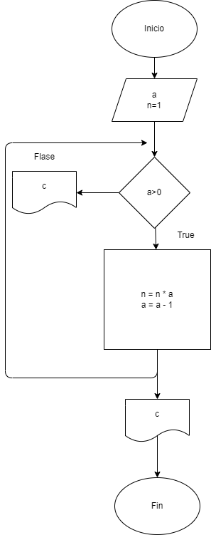

# Taller individual
# Estructuras repetitivas

### 2. Hacer el diagrama de flujo y el programa en Python que lea un número n, entero y positivo, y que lecalcule su factorial y que lo imprima junto con el número leído.

